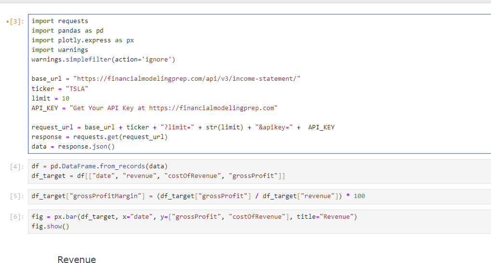
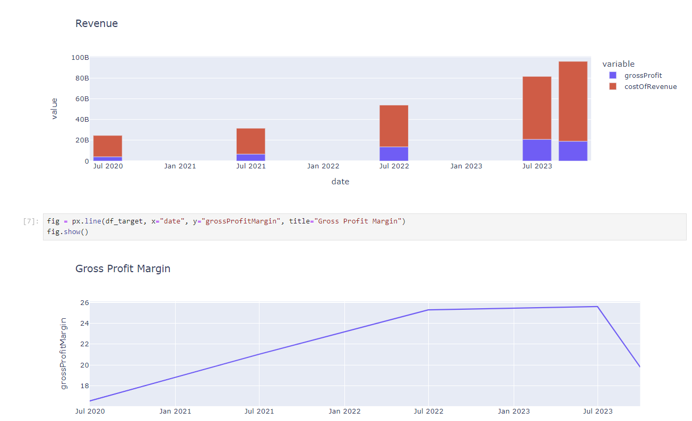

# stock-revenue-analysis
This project analyzes historical gross and net revenues and price trends for stocks. 

This repo also contains web scraping and data cleaning examples of frequent techniques I use. 

